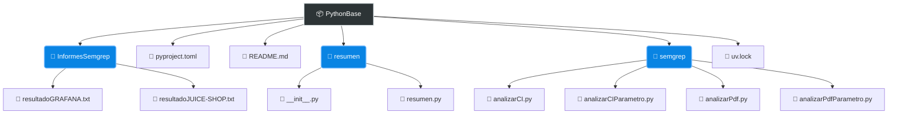

<div align="center">

# 🚀 PythonBase

**Una herramienta robusta para el análisis de código y procesamiento de PDFs utilizando diferentes herramientas propias y de OpenSource**

[](#)
[](#)
<!-- [](#) -->
</div>

---

## 📖 Sobre el Proyecto

Este proyecto automatiza la ejecución de análisis estáticos utilizando Semgrep y procesa reportes PDF para cualquier clase de proyectos del lado de código. Está diseñado para ser rápido, modular y fácil de integrar en flujos de CI/CD.

## ✨ Características Principales

* **Análisis Automático:** Scripts preparados para ejecutar Semgrep con parámetros dinámicos.
* **Gestión de PDFs:** Procesamiento e ingesta de datos desde reportes de vulnerabilidades.
* **Modularidad:** Arquitectura limpia con scripts individuales para cada tarea.

## 🛠️ Instalación

Recomendación de instalar con UV como gestor de paquetes para python
*  📦 [*UV*](https://docs.astral.sh/uv/) — gestor de paquetes ultrarrápido
```bash
pip install uv
```
o sino 
```bash
pipx install uv
```
Comandos básicos para arrancar con UV

```bash
uv init
uv add nombreLibreria
uv tree
```
Para ejecutar los script 
```bash
uv run nombreScript
```

## 📦 Descarga del proyecto de git
Clona el repositorio e instala las dependencias usando tu gestor de paquetes favorito:

```bash
git clone [https://github.com/FedericoNagual/pythonBase.git](https://github.com/FedericoNagual/pythonBase.git)
cd pythonBase
# 1. Crear el entorno virtual e instalar todas las dependencias
uv sync
```

## 📂 Estructura del Proyecto

A continuación, se detalla la arquitectura de carpetas y archivos principales del repositorio:


## 🕵️Ejemplo base
**Se recomienda utilizar algun ejemplo estandarizado como los de la OWASP**

Para esto se recomienda el proyecto de **Juice-Shop**
*  🔍 [*Juice-shop*](https://github.com/juice-shop/juice-shop) — Proyecto para experimentar las vulnerabilidades de los sitios web [*Link DOC*](https://pwning.owasp-juice.shop/companion-guide/latest/introduction/README.html)

Para ejecutar el script con el proyecto y ver los resultados
puede ejecutar 
```bash
cd semgrep
uv run analizarPdfParametro.py ruta-proyecto-juice-shop
```
Si se quiere logear con semgrep para ver la interface que ofrece
*  🔍 [*Semgrep*](https://semgrep.dev/) — Para linkear es necesario hacer unos pasos previos [*Link DOC*](https://docs.semgrep.dev/)

```bash
semgrep login
```

Para proceder a usar la interface y entrar al navegador para ver esos resultados [Link](https://semgrep.dev/orgs/)
```bash
cd semgrep
uv run analizarCIParametro.py ruta-proyecto-juice-shop
```